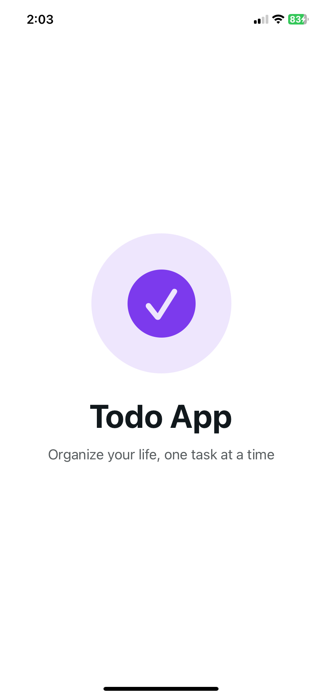
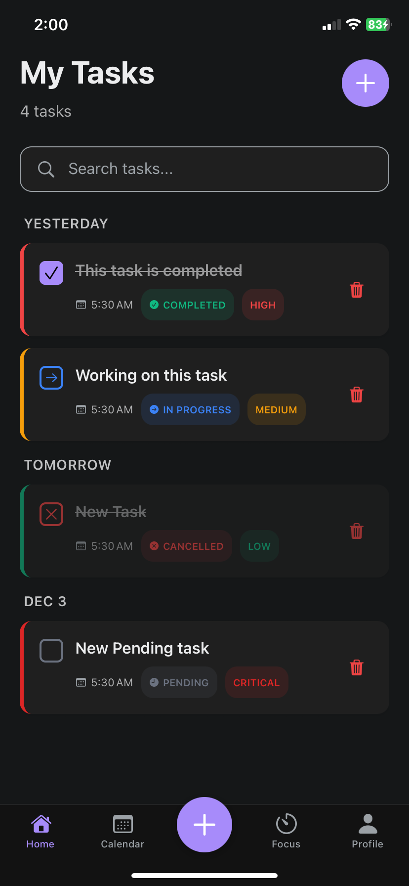
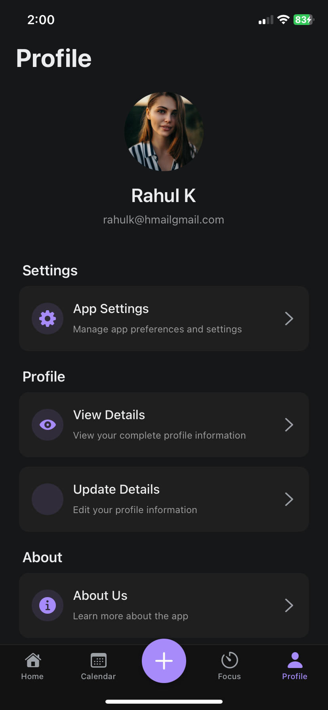
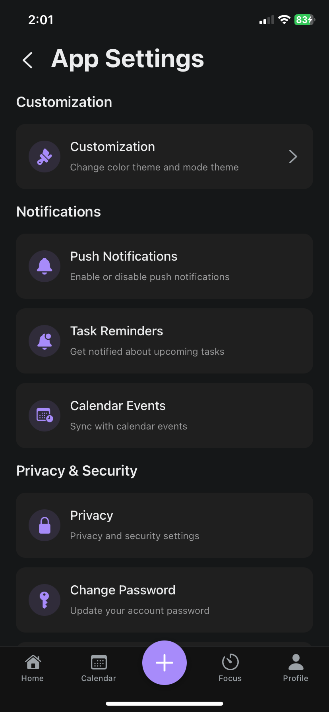
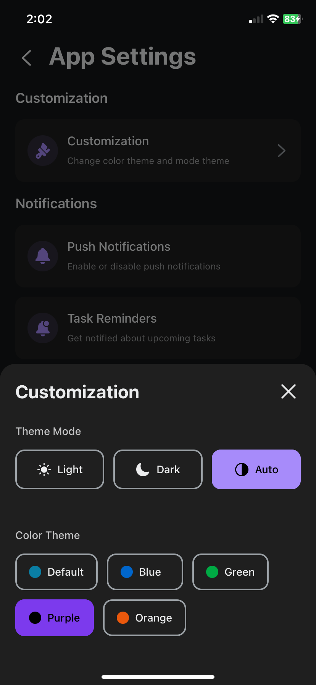
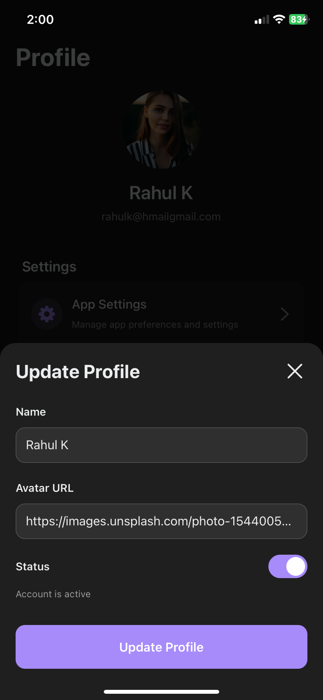
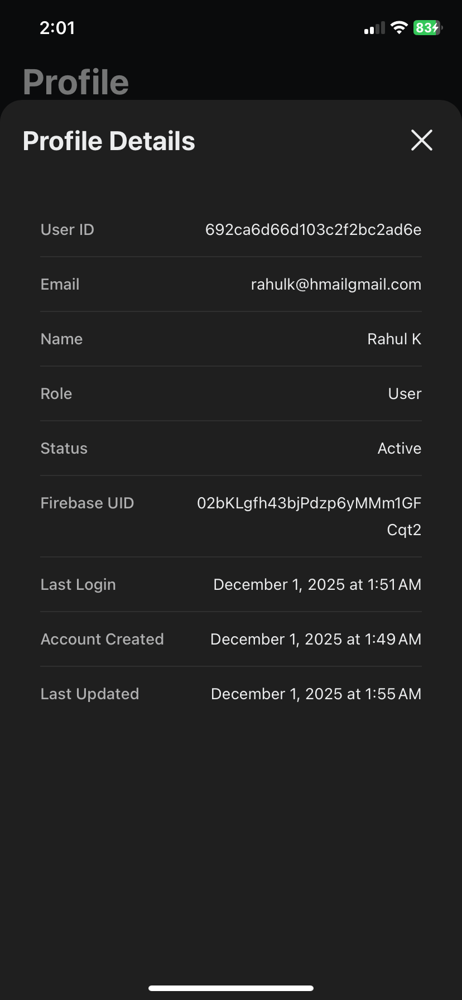
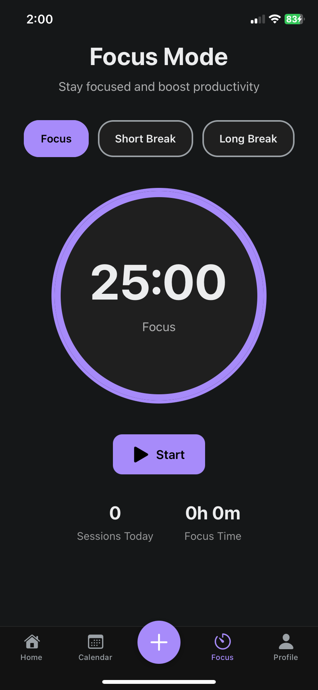
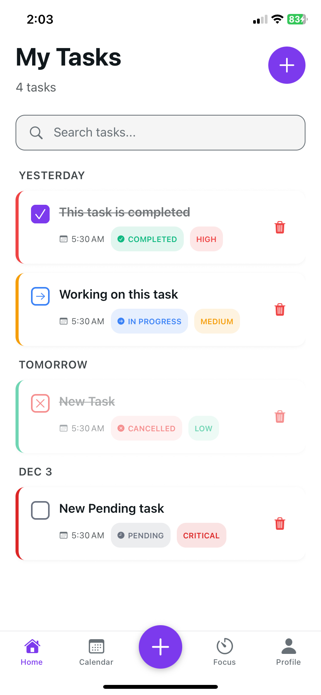
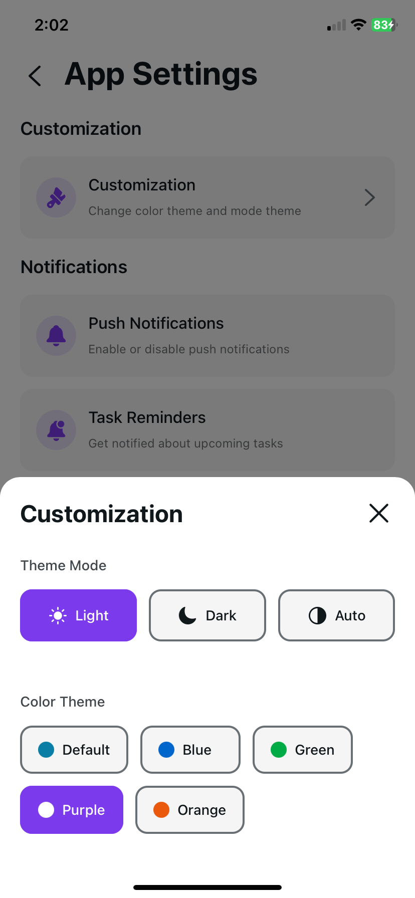

# 📘 TodoApp — React Native Expo App

A beautifully designed and fully functional **Todo & Calendar Management App** built using **React Native, Expo, Context API**, and a clean modular architecture.
The app allows users to manage their daily tasks, view schedules in a calendar, customize the UI theme, and manage their profile with ease.

---

## 🚀 Features

### ✅ **Authentication**

* Secure Login & Signup
* Firebase Auth (Email and password based)
* Persisted session using secure storage

### 📝 **Todo Management**

* Add new tasks
* Edit existing tasks
* Delete tasks
* Mark tasks as completed
* Add description and due date
* Priority tagging (Low / Medium / High)

### 📅 **Calendar Integration**

* Full calendar view for all tasks
* View tasks by date
* Quick navigation to specific dates
* Clean UI with day, week, and month views (if implemented)

### ⏱️ **Task Timer**

* Dedicated timer screen for focused work
* Large timer UI
* Session-based timer (Pomodoro friendly)
* Auto-resume & safe pause handling

### 👤 **User Profile**

* View profile details
* Update name, profile picture, email settings
* Toggle dark/light mode
* Theme customization options

### 🎨 **Customizable UI**

* Dynamic themes (light, dark, AMOLED, etc.)
* Accent color customizations
* Global Theming System using `ThemeContext`
* Reusable UI components (`ThemedView`, `ThemedText`, buttons, cards)

### 📂 **Architecture**

Designed for scalability and clean separation of concerns.

````
app/
 ├── components/         # Reusable UI components
 ├── contexts/           # AuthContext, ThemeContext, TaskContext
 ├── hooks/              # Custom hooks (useTasks, useTheme, useAuth)
 ├── screens/            # Main screens (Todo, Calendar, Timer, Profile, Login)
 ├── services/           # Firebase, API, Storage handlers
 ├── utils/              # Helpers like date formatters, validators
 ├── navigation/         # App navigation structure
 ├── assets/             # Images, icons, fonts
 └── app.json            # Expo project config
````

---

## 🏗️ **Tech Stack**

| Layer                  | Technologies                      |
| ---------------------- | --------------------------------- |
| **Frontend Framework** | React Native (Expo)               |
| **State & Context**    | React Context API, Custom Hooks   |
| **Authentication**     | Firebase                          |
| **Storage**            | AsyncStorage / SecureStore        |
| **Navigation**         | Expo Router / React Navigation    |
| **Calendar**           | `react-native-calendars`          |
| **Styling**            | Custom Stylesheets + Theme System |
| **Build Tool**         | Expo Development Build            |

---

## 📱 App Modules Overview

### **1. Authentication Flow**

* LoginScreen
* SignupScreen
* ForgotPassword (if included)
* Onboarding screens (optional)

### **2. Todo Module**

* Home / Tasks List
* Add Task
* Edit Task
* Task Details
* Filters & Sorting (priority, date, completed status)

### **3. Calendar Module**

* Calendar overview
* Tasks grouped by date
* Quick add from calendar

### **4. Timer Module**

* Pomodoro-style focus timer
* Large center-aligned countdown
* Session history (optional)

### **5. Profile & Settings**

* Profile view
* Edit profile
* Theme selection
* Notifications options
* Logout

---

## ⚙️ Setup Instructions

### 1. Install dependencies

```bash
npm install
```

### 2. Create `.env` file

Add Firebase + Environment secrets.

### 3. Start App

```bash
npx expo start
```

Choose:

* `i` → iOS Simulator
* `a` → Android Emulator
* `d` → Development build (recommended)

---

## 📦 Build System

* Expo EAS Build (Development, Preview, Production)
* Works on both Android & iOS
* Optimized for performance and low bundle size

---

## 🛠️ Code Quality & Principles

* **Modular Components**
* **Clean folder architecture**
* **Reusable functions & hooks**
* **Theming & styles separated cleanly**
* **Firebase integration with error handling**
* **Per-screen optimized state**


<!-- ## 📌 Roadmap (Optional)

* ☐ Notifications & reminders
* ☐ Cloud sync for tasks
* ☐ Collaborators / shared tasks
* ☐ Export tasks as CSV / PDF
* ☐ Widgets support -->

---

## 📸 Screenshots











